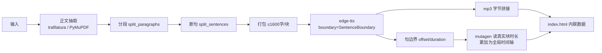

# 文章朗读工作台（readaloud）

把**网页 / PDF / txt / md** 一键转成「带同步高亮的有声读物」：音频用微软神经网络语音（与 Edge「大声朗读」同源），文字与语音逐句对齐，边看边听。

- 音质：`zh-CN-XiaoxiaoNeural` 等 300+ 中文音色，非本地 SAPI 机械音
- 离线可用：产物是 `article.mp3` + `index.html`，双击 HTML 即听，不需要服务器
- 免费无限量：走 `speech.platform.bing.com`，无需 API Key

> 本目录是**开发版**（依赖本机已装好的 Python 与 pip 包）。
> 要发给同事请用同级的 `ReadAloudKit\`，那是内置 Python 运行时的绿色免安装包。

---

## 快速开始

### 推荐：网页工作台

双击 **`打开朗读工作台.bat`** → 浏览器自动打开 `http://127.0.0.1:8765/`

| 标签 | 用途 |
|---|---|
| 📁 本地文件 | 点「浏览目录」像资源管理器一样翻到文件（任意目录、含各硬盘分区），或从「最近的文件」里直接点 |
| 🌐 网页地址 | 粘一个 URL，自动抽正文去广告 |
| 📥 拖入上传 | 从任意位置（微信目录、U 盘、桌面）把文件拖进框里 |
| 📋 剪贴板 | 内网页面 / 钉钉文档：`Ctrl+C` 后点一下按钮就行 |
| ✏️ 粘贴文本 | 直接粘文字朗读 |

选好内容 → 右边挑音色语速 → 点「**▶ 开始朗读**」→ 完成后点「**▶ 去听**」。

### 选错了怎么办：预估 + 取消

**点之前**：设置区下方会实时显示「将读 N 字 → 音频约 X 分钟，合成约 Y 秒，mp3 约 Z MB」。
如果内容被字数上限截断，会用红字标出 **⚠ 实际有 438,137 字，被截到 5%**——这就是"听着听着
发现内容不全"的唯一原因，看到这条警告把上限改大或填 `0` 即可。

**点之后**：按钮变成「**⏹ 取消**」，随时点它，约 **0.5 秒**内停下。取消保证三件事：

- 作品库**不会**多出残缺条目
- 该作品**原有的完整版本不受影响**（新音频先写 `article.part.mp3`，全部成功才改名）
- 取消后可以**立刻**改设置重新提交，不用等、不用重启服务

> 注意：「开始朗读」是**转换**过程，不是播放。要暂停**播放**去播放页按空格。

### 整本书请按章转

选中 PDF 后点「**📑 看目录**」，工具会自己认出章节并列出来（页范围 / 字数 / 听起来多久）：

```
1  引言                    9-14页 · 7,664字 · 24 分钟
2  第 1 章 AI Agent 入门  15-37页 · 32,693字 · 1.7 小时
3  第 2 章 上下文工程      38-79页 · 57,096字 · 3.0 小时
```

点一行即填入该章页码；勾选多行会合并成 `9-14,38-79` 一次转成一篇。
识别顺序：**PDF 内置书签 → 文前目录页（回正文定位真实页）→ 标题字号启发**；
三者都失败时给出「按页数均分」的建议，不会让你对着空框发呆。

命令行等价：`python readaloud.py toc --pages 某本书.pdf`（只 `toc` 不带路径会出文件菜单）。

同一个 PDF 填不同「页范围」会生成**互相独立**的作品（页范围参与目录哈希），不会互相覆盖。
例如《深入理解 AI Agent》310 页全书 43.8 万字，一次跑完要 48 分钟合成、22 小时音频；
按章跑则每章 3~6 分钟。

播放页里点任意一句话从该句开始听，`空格` 暂停，`←→` 跳句，`↑↓` 调速。
下方「作品库」列出所有转过的文章，可直接听 / 打开文件夹 / 删除。

> 服务只监听 `127.0.0.1`，局域网访问不到，公司电脑上也安全。
> 重复双击会直接打开已在运行的实例，不会起第二个服务。

### 免浏览器：命令行方式

```powershell
cd D:\aiworkplace\Documents\DeepChat\readaloud
python readaloud.py                      # 不带参数 → 列出最近文件，敲编号
python readaloud.py D:\docs\报告.pdf     # 直接指定
```

也可以把文件**拖到 `听文章.bat` 图标上**（支持一次拖多个）。

---

## 输入方式

| 输入 | 说明 | 抽取质量 |
|---|---|---|
| `https://...` | trafilatura 抓正文，自动去导航/广告/评论区 | 静态博客、新闻站很好；纯 JS 渲染页需改用 clipboard |
| `xxx.pdf` | PyMuPDF 提取，剔除跨页重复的页眉页脚与页码；按字号识别标题并断段；整页跳过目录 | 文字型 PDF 佳；**扫描版需先 OCR** |
| `--pages` 多段 | `9-14,38-79` 会合并相邻/重叠区间后一次性抽取 | 读多章不用转多次 |
| `toc` 子命令 | `python readaloud.py toc --pages 书.pdf` 打印章节页范围表 | 命令行里也能查目录 |
| `xxx.md` / `xxx.txt` | 去 markdown 标记，按空行分段 | 直接可用 |
| `xxx.html` | 本地另存的网页，走同一套正文抽取 | 等价于 URL |
| `clipboard` | 读 Windows 剪贴板（Win32 API 直读，毫秒级） | **最鲁棒**，任何能选中的页面都行 |
| `-` | 从标准输入读 | 管道用 |

## 常用参数

| 参数 | 默认 | 说明 |
|---|---|---|
| `--voice` | `zh-CN-XiaoxiaoNeural` | 音色。`python readaloud.py list` 看全部中文音色 |
| `--rate` | `+0%` | 语速，如 `+20%`、`-15%`（必须带正负号） |
| `--pitch` | `+0Hz` | 音调，如 `+20Hz` |
| `--max-chars` | 自动 | 超大文档默认只取前 20000 字（约 80 分钟音频）；`0`=不限 |
| `--pages` | 全部 | **PDF 页范围**，如 `--pages 20-35` 或 `--pages 5`。整本书必读这一项 |
| `--no-open` | — | 生成后不自动开浏览器 |
| `--serve` | — | 起本地 HTTP 服务打开（`--port` 改端口，默认 8765） |
| `-o` | `.\output` | 输出根目录 |

例：男声 + 快一点

```powershell
python readaloud.py 报告.pdf --voice zh-CN-YunxiNeural --rate +18%
```

---

## 播放器操作

| 操作 | 效果 |
|---|---|
| 点击任意句子 | 从该句开始读 |
| `空格` | 播放 / 暂停 |
| `←` `→` | 上一句 / 下一句 |
| `↑` `↓` | 语速加减（即时生效，用 playbackRate，不重新合成） |
| 「滚动」按钮 | 关闭后文字不再自动跟随滚动，可自由翻阅 |
| `◐` | 深 / 浅色切换 |
| 「← 工作台」 | 网页模式下返回工作台（双击 HTML 打开时不显示） |

进度按文章存 localStorage，**关掉再打开会从上次位置继续**。

---

## 常选中文音色

| 音色 | 特点 |
|---|---|
| `zh-CN-XiaoxiaoNeural` | 晓晓，女声，自然温和，默认 |
| `zh-CN-XiaoyiNeural` | 晓伊，女声，更年轻 |
| `zh-CN-YunxiNeural` | 云希，男声，清亮 |
| `zh-CN-YunyangNeural` | 云扬，男声，新闻播报腔 |
| `zh-CN-YunjianNeural` | 云健，男声，浑厚 |
| `zh-CN-liaoning-XiaobeiNeural` | 东北话晓贝，听个乐 |

---

## 常见问题

**抓不到内容 / 抓错内容**
用 clipboard 方式。判断标准：页面上能 Ctrl+A 选中正文，就能被朗读。

**PDF 抽出来是乱的**
大概率是扫描版（整页是图片）。先 OCR 再喂进来。

**听着发现内容不全**
字数上限截断了。看页面红字警告，把「字数上限」改大或填 0，或用「页范围」按章读。

**想只要 mp3（通勤听、导手机）**
`output/<文章>/article.mp3` 就是完整音频，直接拷走即可。

**公司内网能不能用**
需要能访问 `speech.platform.bing.com:443`。检测：

```powershell
Test-NetConnection speech.platform.bing.com -Port 443 -InformationLevel Quiet
```

返回 `True` 即可用。若只允许内网代理，给 PowerShell 设 `HTTPS_PROXY` 后重试。

**长文要等多久**
约 1 分钟音频 / 1 秒合成（实测 6464 字 → 22.6 分钟音频，耗时 48 秒）。

---

## 实现要点（改动前必读）



1. **为什么分块**：单次请求过长易被服务端截断；分块后可逐块重试、可中途取消。
2. **为什么不漂移**：每块起始时间 = 前面所有块 `mutagen` 读到的**真实 mp3 时长**之和，
   而非按字数估算。实测 5 块 1358s 累计偏差 0.001%。
3. **句边界来源**：服务端返回的 `SentenceBoundary` 事件（单位 100ns，`/1e4` 转毫秒）。
   块内句数与服务端返回数一致时走快路径直接取 offset；不一致时退化为分段线性插值。
4. **HTML 内联数据**：`file://` 下 `fetch()` 会被 CORS 拦，但 `<audio src>` 不拦。
   所以全文和时间轴直接内联进 HTML，音频用相对路径，双击即听。
5. **edge-tts 不依赖 Edge 浏览器**：它只是调用微软在线合成接口。
6. **取消安全**：音频先写 `article.part.mp3`，全部成功才 `replace()` 成 `article.mp3`，
   所以取消/断电都不会破坏已有完整版本。

---

## 依赖

```
edge-tts  mutagen  trafilatura  PyMuPDF
```
